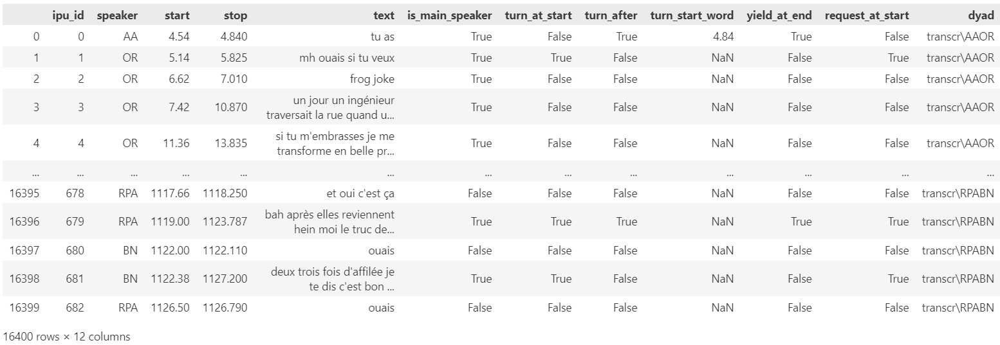
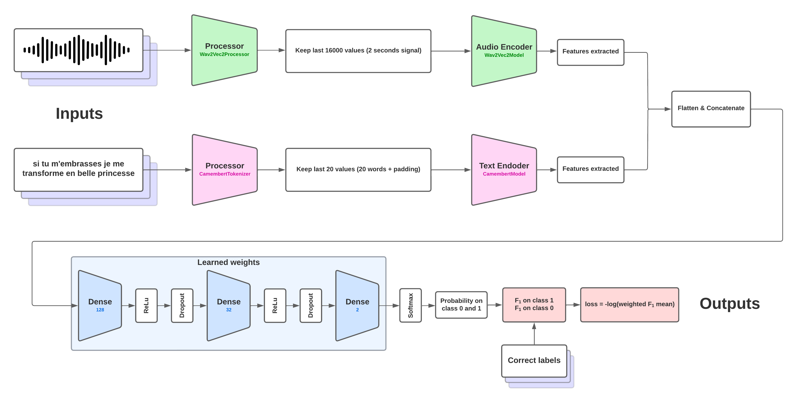

- [ParoleNet 0.3](#parolenet-03)
- [Présentation du problème et des données](#présentation-du-problème-et-des-données)
- [Présentation du modèle](#présentation-du-modèle)
- [Métrique et apprentissage](#métrique-et-apprentissage)

# ParoleNet 0.3

ParoleNet est un modèle multimodal de prédiction du tour de parole. Son objectif principal est de déterminer, à la fin d’une phrase donnée, si la personne en cours d’élocution continuera de parler ou cédera la parole à son interlocuteur. Il prend en entrée les 20 derniers mots de la phrase ainsi que les deux dernières secondes de l'enregistrement audio et réalise la classification sur deux classes du tour de parole. ParoleNet a été entraîné sur un jeu de données spécifique de la langue française contenant 16400 phrases. Nous avons observé des résultats encourageants, où le modèle a appris à anticiper le tour de parole avec une performance supérieure à un modèle initialisé au hasard. L’analyse des résultats statistiques suggère que le modèle est capable de comprendre un lien entre les données d’entrée et la prédiction du tour de parole, et non uniquement une prédiction statistique sur la fréquence de chaque classe décorrélée des données d'entrées. Ces observations indiquent un apprentissage significatif du modèle, renforçant ainsi la validité de notre approche.

# Présentation du problème et des données

L’objet de la problématique réside dans la prédiction de l’attribution de la parole au cours d’une discussion. Notre champ d’étude se restreindra à un dialogue impliquant deux participants. Nous sommes ainsi confrontés à une problématique de classification à deux classes : $0$ indiquant que la personne qui s’exprime continuera de parler après la fin de sa phrase, et $1$ signifiant qu’elle laissera la parole à son interlocuteur. 

Les données que nous allons utiliser sont présentées de manière détaillée dans le tableau en $\textbf{Figure.1}$ ci-dessous. Les colonnes que nous allons utiliser sont : "stop" qui permet de récupérer le timecode de la fin de la phrase, "text" qui permet de récupérer ce qui vient d’être prononcé avant le timecode, "turn_after" qui indique si la personne va céder la parole ou non. 

Le dataloader a été conçu de manière à générer des exemples composés de trois éléments distincts. Le premier élément consiste en un texte formé par les 20 derniers mots prononcés dans la phrase. En cas de phrase plus courte, un caractère de padding de l’encodeur textuel est ajouté pour maintenir la structure. Le deuxième élément est constitué de la dernière seconde prononcée avant la fin de la phrase dans le fichier audio. Cette caractéristique vise à représenter le ton final de la phrase, que ce soit montant ou descendant, par exemple. Enfin, le dernier élément correspond au label, à savoir la valeur de la classe, soit $0$ ou $1$ pour indiquer le tour de parole.

# Présentation du modèle

Le modèle élaboré est exposé dans la $\textbf{Figure.2}$. Il se compose d’une première phase d’encodage des données, utilisant Wave2Vec2 pour les données audio et Camembert pour les données textuelles. Chacun de ces composants fait appel à un processeur dédié pour le traitement préliminaire des données avant leur encodage. Un processus de padding est appliqué entre les étapes de traitement et d’encodage afin d’assurer la cohérence du flux de données. Les encodeurs génèrent des tenseurs de features, qui sont ensuite aplatis avant d’être concaténés en un unique tenseur unidimensionnel, conservant ainsi une taille constante.

Après l’extraction du tenseur, le modèle le transmet à une cascade de couche dense, de fonction d’activation ReLU et de dropout de 10%. Sur la sortie est appliquée un softmax, ce processus représente ainsi une prédiction exprimée sous forme de densité de probabilité pour les deux classes.

# Métrique et apprentissage

Dans le cadre de la résolution de notre problème de classification, il semble judicieux d’envisager l’utilisation d’une fonction de perte de cross entropie. Les tests que nous avons effectués montrent que le modèle a tendance à rapidement converger vers la classification d’une seule classe, indépendamment de l’exemple présenté, en l’occurrence la classe $0$. En effet, dans notre jeu de données, la classe $0$ représente 82% des exemples, tandis que la classe $1$ ne constitue que 18%. Par conséquent, le modèle réalise que pour maximiser sa précision, la méthode la plus simple est de prédire systématiquement la classe $0$, obtenant ainsi une précision de 82%, ce qui entrave la progression de l’apprentissage. Il est donc logique de considérer l’utilisation de métriques prenant en compte les faux positifs, telles que le rappel, et pour englober ces aspects, le $F_1$ score. 

Dans le calcul de la précision et du rappel, nous avons recouru aux valeurs de probabilités attribuées pour déterminer les vrais positifs, les faux positifs et les faux négatifs. Plus précisément, si le modèle attribue une probabilité de $0.4$ à la classe $0$ et, par conséquent, de $0.6$ à la classe $1$ pour un exemple donné, ces valeurs seront respectivement comptées comme $0.6$ en vrais positifs pour le score de la classe $1$. Ce même principe s’applique aux faux positifs et aux faux négatifs. Ainsi, nous calculons le score $F_1$ pour la classification de chacune des deux classes. Et nous en faisons la moyenne pondérée par un poids qui dépend de la fréquence de chaque classe dans le batch. La fonction de perte est l'opposé du logarithme de ce $F_1$ score pondéré.